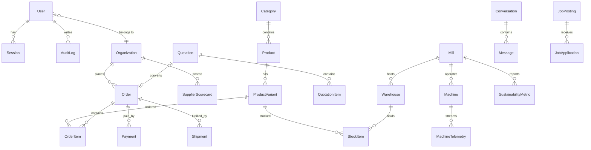

# Database

PostgreSQL 16 + Prisma. Schema: `packages/database/prisma/schema.prisma`.

## ERD (domain view)



## Conventions

- IDs are `cuid()`; money is `Decimal` (never floats); quantities are integers
- Every table with user-facing writes has `createdAt`/`updatedAt`
- Indexes on all foreign keys and status+date query paths
- `MachineTelemetry` is a hypertable candidate if you adopt TimescaleDB

## Migrations & seed

```bash
pnpm db:generate       # prisma generate
pnpm db:migrate        # prisma migrate deploy (CI/prod)
pnpm --filter @sylvara/database migrate:dev   # create a new migration locally
pnpm db:seed           # catalog, mills, ESG metrics, demo admin
```

## Backup & recovery

See `docs/backup-recovery.md`: nightly `scripts/backup.sh` (pg_dump → S3,
35-day retention) plus provider PITR (RDS/Cloud SQL/Flexible Server).
